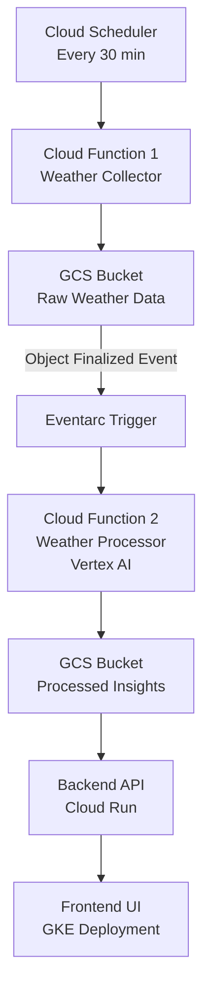

# GCP Weather AI Insights Project

**A fully cloud-native, event-driven weather insights pipeline built on Google Cloud. This project demonstrates scalable serverless architecture, AI-powered data enrichment using Vertex AI, containerization, Kubernetes orchestration, and Infrastructure as Code with Terraform.**

---

# Table of Contents

- [Project Overview](#project-overview)
- [High Level Architecture Diagram](#high-level-architecture-diagram)
- [Repository Structure](#repository-structure)
- [Infrastructure Components](#infrastructure-components)
- [Security & Permissions](#security--permissions)
- [Cost Optimization](#cost-optimization)
- [Deployment Overview (High-Level)](#deployment-overview-high-level)
- [Documentation in This Repository](#documentation-in-this-repository)
- [Acknowledgements](#acknowledgements)

---

# Project Overview

This system automatically:

1. **Collects real-time weather data** every 30 minutes from OpenWeather API for 5 Global Cities.

2. **Stores raw data** in Google Cloud Storage.

3. **Processes weather data** using Vertex AI (Gemini models) to generate:

   - Descriptive summaries
   - Weather mood/interpretation

4. **Stores processed insights** back into GCS.

5. **Serves insights via a backend API** deployed on Cloud Run.

6. **Displays data in a modern UI**, deployed on Google Kubernetes Engine (GKE).

Everything is built using **least-privilege IAM**, **secure secret management**, and **cost-optimized serverless + containerized components**.

---

# High Level Architecture Diagram



---

# Repository Structure

    gcp-weather-ai-insights-project/
    ├── .github/workflows/ # CI/CD yml files
    ├── backend/
    │ ├── api/ # Cloud Run backend API
    | | └── README.md # API Documentation
    │ ├── weather_collector/ # Cloud Function 1
    │ └── weather_processor/ # Cloud Function 2
    ├── frontend/ # React UI
    | └── k8s/ # Kubernetes manifests
    ├── infra/ # Terraform IaC
    ├── DEPLOYMENT.md # Deployment Documentation
    ├── PROJECT_REPORT.md # Project Report
    └── README.md # (this file)

---

# Infrastructure Components

This project uses the following GCP services:

1. **Cloud Scheduler**

   Triggers the ingestion function every 30 minutes.

2. **Cloud Functions Gen2**

   - **Cloud Function 1 (weather collector)**: Fetches weather data → writes to GCS.

   - **Cloud Function 2 (weather processor)**: Triggered via Eventarc on GCS Bucket finalized → calls Vertex AI → processes → writes to GCS.

3. **Eventarc Trigger**

   Listens for GCS object finalization events and routes them to Cloud Function 2.

4. **Google Cloud Storage**

   **raw_weather_data/** folder: Raw weather JSON

   **processed_weather_data/** folder: Enriched insights JSON

5. **Vertex AI (Gemini)**

   Used to generate smart summaries & moods.

6. **Cloud Run**

   Backend API serving the processed insights from GCS.

7. **Artifact Registry**

   Stores containerized React UI.

8. **Google Kubernetes Engine (GKE)**

   Hosts the containerized React UI.

9. **Secret Manager**

   Stores the OpenWeather API key.

10. **Terraform IaC**

    Define all infrastructure except Cloud Run source deploy.

---

# Security & Permissions

- **Least privilege** enforced via dedicated service accounts

- **Ingestion Function SA**

  - storage.objectCreator
  - secretmanager.secretAccessor

- **Processing Function SA**

  - storage.objectCreator
  - storage.objectViewer
  - aiplatform.user
  - eventarc.eventReceiver
  - run.invoker

- Secrets are accessed securely via **Secret Manager**.

---

# Cost Optimization

- Autopilot GKE ensures pods run only when traffic exists.

- Minimal resource allocation for workloads.

- No external load balancer needed unless ingress enabled.

---

# Deployment Overview (High-Level)

1. Deploy Infrastructure using Terraform

   ```bash
   terraform init
   terraform plan
   terraform apply
   ```

2. Deploy backend API (Cloud Run)

   ```bash
   gcloud run deploy weather-backend-api \
     --source=./backend/api \
     --region=<region> \
     --allow-unauthenticated \
     --service-account=<service account> \
     --set-env-vars=<environment variables>
   ```

3. Deploy frontend UI to GKE

   ```bash
   docker build -t <image> frontend/
   docker push <image>
   kubectl apply -f frontend/k8s/deployment.yaml
   kubectl apply -f frontend/k8s/service.yaml
   ```

4. Access frontend via LoadBalancer IP

---

# Documentation in This Repository

- `README.md`: Main project & infrastructure documentation

- `DEPLOYMENT.md`: Exact step-by-step deployment guide

- `backend/api/README.md`: API documentation

---

# Acknowledgements

This project demonstrates practical cloud-native engineering using GCP services, event-driven architecture, AI integration, and Kubernetes orchestration.
